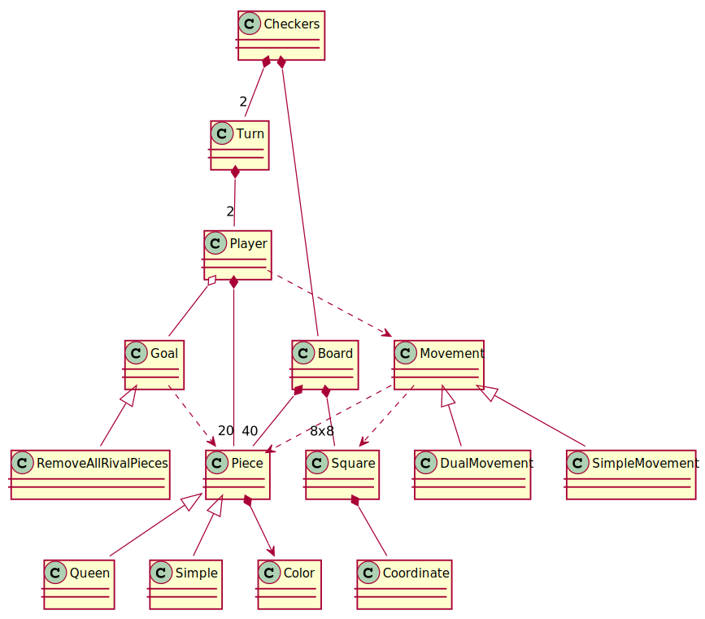
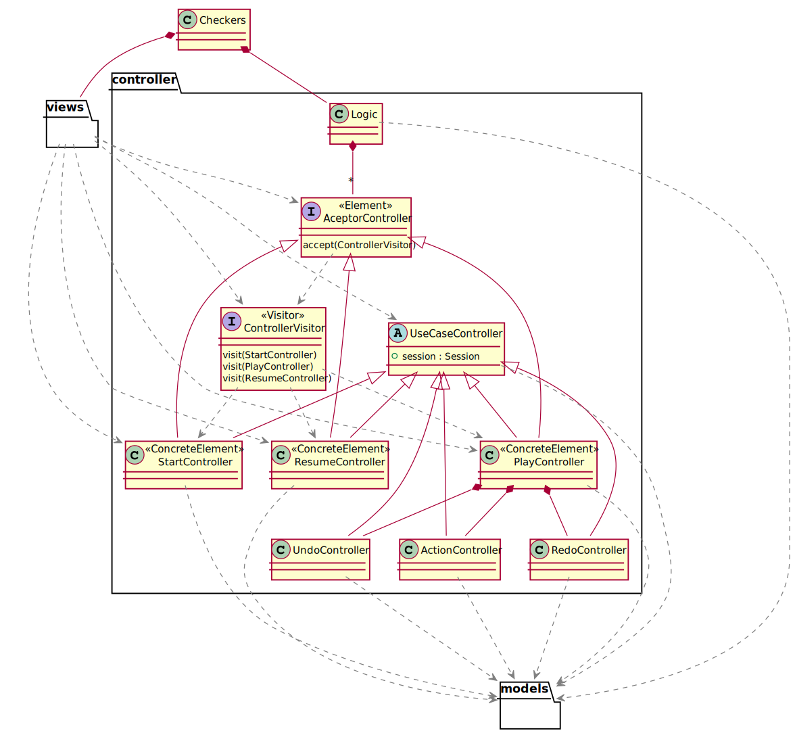
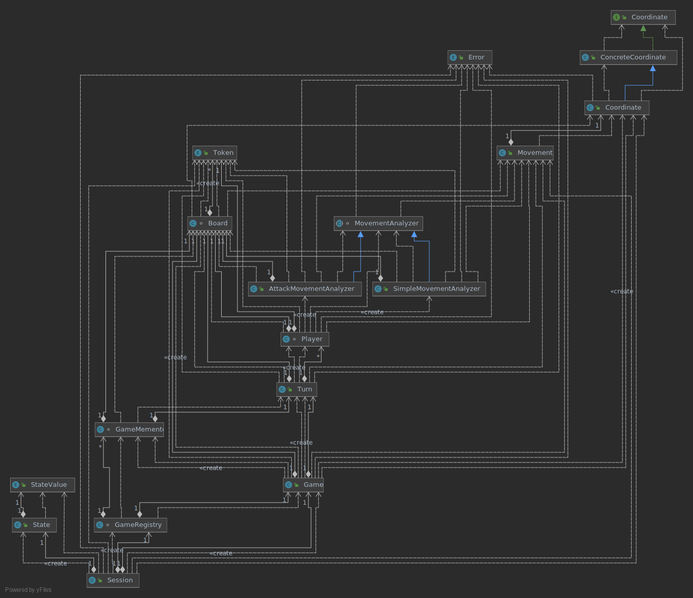

# Domain model

# Use cases

# Design

## Views

## Controllers

## Models

# Práctica final del curso de Patrones de Diseño

Esta práctica es un tanto libre. Vamos a proponer un enunciado pero Luis está abierto a que se realice otro proyecto de juego, como se comentó en clase y se especifica en el punto "Otras alternativas de práctica" en este mismo readme.

## Juego de "Las Damas"

Se propone realizar una implementación del juego de las damas, con consola.

El juego de las damas (denominación como se conoce el juego en España) es, si se puede decir, una simplificación del ajedrez, en la que solamente se juega con peones. Los peones se mueven en diagonal y pueden saltar por encima de otros peones para "comerlos". 

Las instrucciones completas se pueden ver en la [wikipedia](https://es.wikipedia.org/wiki/Damas). Aunque ellos muestran como distintas implementaciones. Nosotros jugaremos en un tablero de 8x8 y donde cada jugador tiene 12 fichas de cada color. Este vídeo de Youtube [aclara las reglas en 2 minutos](https://www.youtube.com/watch?v=jA-zevc2fao).

Notas para tener en cuenta:

 - El objetivo del juego es encontrar problemas para la aplicación de patrones de diseño vistos en el curso.
 - Se puede realizar el ejercicio de manera progresiva, tal como se han ido presentando los ejercicios del TicTacToe durante el curso, con versiones que presentan un problema y versiones que lo corrigen. Pero no se indica qué pasos se tiene que hacer ni es obligado hacer varios pasos, sino que alguien podría si le parece mejor desarrollar una versión determinada desde el inicio.

## Otras alternativas de práctica

Como hemos dicho, esta práctica es un poco libre. Si una persona prefiere realizar otro juego, también es posible. Sin embargo, el día de la corrección preferimos abordar soluciones del juego de las damas que se supone que todos vamos a conocer.

Los lenguajes de programación que se pueden usar son variables, como se ha comentado en otras prácticas (TypeScript, Javascript, C#, PHP...)

Si alguien prefiere usar el tiempo de esta práctica para simplemente interiorizar el contenido del curso (los patrones, las soluciones de los ejercicios que se han visto en clase, o simplemente mejorar la práctica del Mastermind o el supermercado) también está permitido. Lo importante es dominar la materia de patrones. En ese caso, no hace falta subir código a este repositorio, sino completar los repositorios de las prácticas anteriores.
